# 📊 Statistics for Machine Learning: Comprehensive Guide

This repository serves as a deep-dive reference for statistical fundamentals, transitioning from basic data types to complex bivariate analysis.

---

## 1. Introduction to Statistics
Statistics is the backbone of Machine Learning, providing the tools to separate "signal" from "noise."

* **Descriptive Statistics:** Tools used to describe the features of a specific dataset. It does not allow us to make conclusions beyond the data we have analyzed.
* **Inferential Statistics:** Uses a random sample of data taken from a population to describe and make inferences about the whole population. 
* **Population ($N$) vs. Sample ($n$):** * **Population:** The entire collection of items under consideration.
    * **Sample:** A representative subset of the population. We use sample statistics ($\bar{x}, s$) to estimate population parameters ($\mu, \sigma$).
 
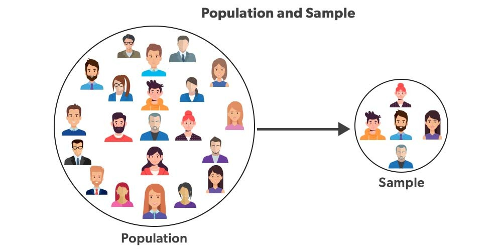


---

## 2. Data Fundamentals
Before applying any model, you must identify the data type to choose the correct algorithm.

* **Numerical (Quantitative):**
    * **Discrete:** Whole numbers you can count (e.g., Number of children).
    * **Continuous:** Measurements that can take any value (e.g., Height, Temperature).
* **Categorical (Qualitative):**
    * **Nominal:** Categories with no inherent order (e.g., Gender, Nationality).
    * **Ordinal:** Categories with a clear ranking (e.g., Education level: High School < Bachelors < Masters).
 
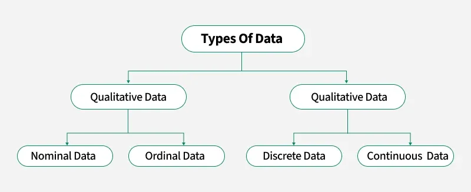


---

## 3. Measures of Central Tendency
These metrics help identify the "typical" value in your dataset.

* **Mean:** The arithmetic average. Sensitive to outliers.
* **Median:** The middle value. Best for skewed data (e.g., Salary data).
* **Mode:** The value that appears most often. Useful for categorical data.
* **Weighted Mean:** Used when certain data points contribute more to the final result than others (e.g., calculating GPA).
* **Trimmed Mean:** Calculating the mean after removing a fixed percentage (e.g., 5% or 10%) of the top and bottom values. This reduces the impact of extreme outliers.

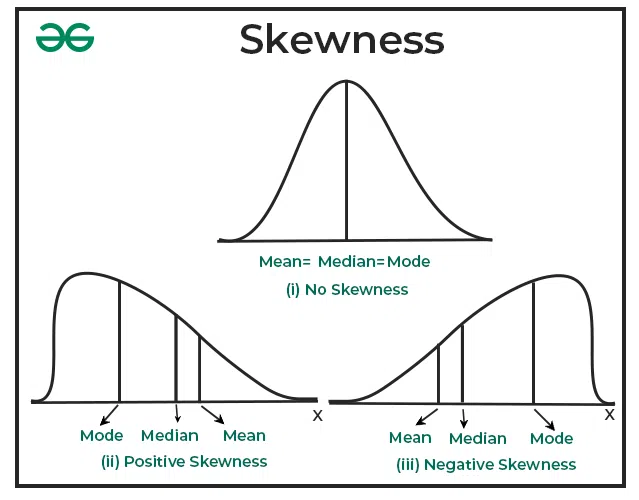

### 🐍 Python Implementation:
```python
import numpy as np
from scipy import stats

data = [10, 12, 12, 13, 15, 100] # 100 is an outlier

print(f"Mean: {np.mean(data)}")
print(f"Median: {np.median(data)}")
print(f"Mode: {stats.mode(data, keepdims=True).mode[0]}")
print(f"Trimmed Mean (10%): {stats.trim_mean(data, 0.1)}")
```


---

## 4. Measures of Dispersion
Dispersion tells us how "spread out" the data is around the center.

* **Range:** Simple but ignores the distribution of the internal data.
* **Variance ($\sigma^2$):** The average of the squared differences from the mean. It quantifies the degree of spread.
* **Standard Deviation ($\sigma$):** The square root of variance. It is expressed in the same units as the data, making it easier to interpret.
* **Coefficient of Variation (CV):** Expressed as a percentage. It allows you to compare the volatility of two different datasets (e.g., comparing the price fluctuations of Gold vs. Bitcoin).

### 🐍 Python Implementation:
```python
std_dev = np.std(data)
variance = np.var(data)
cv = (std_dev / np.mean(data)) * 100
```


---

## 5. Univariate Analysis (Visualizing One Variable)
Focuses on understanding the distribution of a single feature.

* **Categorical Data**
    * **Frequency Table:** Lists the count of each category.

    * **Cumulative Frequency:** Useful to see how many observations fall below a certain category (mostly for ordinal data).

* **Numerical Data**
    * **Histogram:** Displays the "density" of data across bins. It helps identify if data is Normal, Right-Skewed, or Left-Skewed.
 
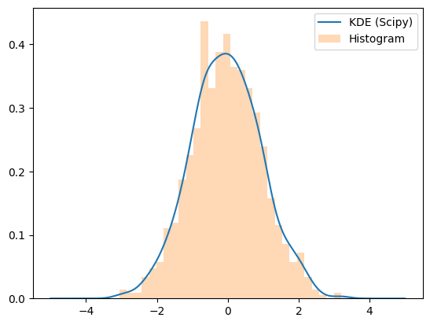


---

## 6. Bivariate Analysis (Relationships)
Analyzing how two variables interact with each other.

* **Categorical -** Categorical (Contingency Table): Also known as a "Crosstab." It shows the relationship between two categories (e.g., Gender vs. Voting Preference).

* **Numerical -** Numerical (Scatter Plot): Used to check for linear or non-linear relationships. Essential for Linear Regression.

* **Categorical -** Numerical: Often analyzed using Grouped Box Plots or Bar Charts to see how a numeric value (e.g., Income) varies across categories (e.g., Job Title).

### 🐍 Python Implementation (Bivariate):
```python
import pandas as pd
import seaborn as sns

# Crosstab
pd.crosstab(df['Gender'], df['Purchased'])

# Scatter Plot
sns.scatterplot(x='Age', y='Salary', data=df)

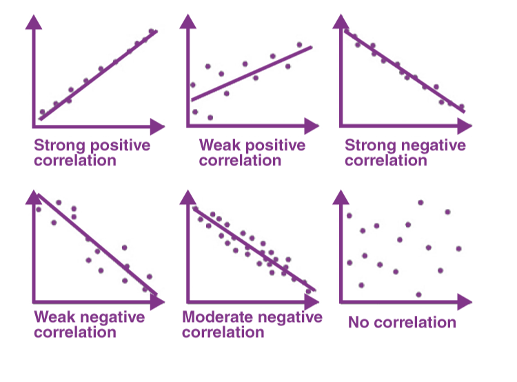

# Box Plot (Categorical vs Numerical)
sns.boxplot(x='Category', y='Value', data=df)
```


---

## 🛠️ Getting Started & Installation

To run the statistical analysis and visualizations mentioned in this guide, you will need **Python 3.x** and the following data science libraries:

### 1. Install Dependencies
Run the following command in your terminal/command prompt:

```bash
pip install numpy pandas scipy matplotlib seaborn
```

### 2. Library Overview
* **NumPy:** Used for high-performance mathematical operations and arrays.

* **Pandas:** The primary tool for data manipulation and creating Frequency Tables/Crosstabs.

* **SciPy:** Essential for advanced statistics like Trimmed Mean, Z-Scores, and Hypothesis Testing.

* **Matplotlib/Seaborn:** Used for Univariate (Histograms) and Bivariate (Scatter plots, Box plots) visualizations.

### 3. Quick Setup Code
Copy this block at the top of your Python script to ensure all tools are ready:

```python
import numpy as np
import pandas as pd
import matplotlib.pyplot as plt
import seaborn as sns
from scipy import stats

# Set visual style for plots
sns.set_theme(style="whitegrid")
```


---

## 📊 Summary Table: Choosing the Right Analysis

Use this table as a quick reference to determine which statistical method or visualization fits your data type.

| Analysis Type | Variable 1 | Variable 2 | Goal | Recommended Tool / Visualization |
| :--- | :--- | :--- | :--- | :--- |
| **Univariate** | Categorical | - | Distribution of categories | Bar Chart / Frequency Table |
| **Univariate** | Numerical | - | Distribution of values | Histogram / Box Plot / PDF |
| **Bivariate** | Categorical | Categorical | Relationship between groups | Contingency Table (Crosstab) / Heatmap |
| **Bivariate** | Numerical | Numerical | Correlation / Trend | Scatter Plot / Line Plot |
| **Bivariate** | Categorical | Numerical | Comparison of groups | Grouped Box Plot / Bar Chart |

---

### 🔍 Understanding the Box Plot
The Box Plot is a powerful univariate and bivariate tool that summarizes the **Median**, **Quartiles**, and **Outliers** in a single view.

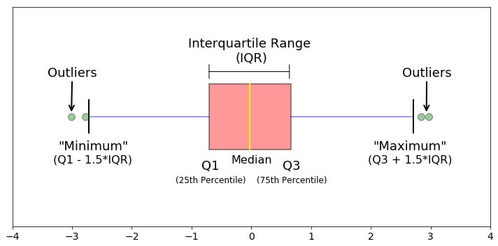


* **Median (Q2):** The middle line in the box.
* **Interquartile Range (IQR):** The distance between the 25th (Q1) and 75th (Q3) percentiles (the box itself).
* **Whiskers:** Typically represent $1.5 \times IQR$.
* **Outliers:** Points that fall outside the whiskers.


---

## 7. Quantiles and Percentiles
These measures describe the position of a data point relative to the rest of the dataset.

* **Percentile:** A value below which a certain percentage of observations fall. For example, the 90th percentile is the value higher than 90% of the other data points.
* **Quantiles:** Points that divide the distribution into equal intervals. 
    * **Quartiles ($Q_1, Q_2, Q_3$):** Divide data into four equal parts (25%, 50%, 75%).
* **How to Calculate:** Data must be sorted in ascending order first. The index $i$ is calculated as $i = \frac{P}{100} \times n$.

---

## 8. The 5-Number Summary & Boxplots
The 5-Number Summary is a descriptive statistic that provides a snapshot of the dataset's distribution.

1. **Minimum:** The smallest value (excluding outliers).
2. **First Quartile ($Q_1$):** 25th percentile.
3. **Median ($Q_2$):** 50th percentile.
4. **Third Quartile ($Q_3$):** 75th percentile.
5. **Maximum:** The largest value (excluding outliers).

### Boxplot Theory
A Boxplot visually represents the 5-number summary. The "box" shows the Interquartile Range ($IQR = Q_3 - Q_1$), and the "whiskers" extend to the minimum and maximum values within $1.5 \times IQR$.
* **Side-by-Side Boxplots:** Used to compare the distribution of a numerical variable across different categories (e.g., comparing salary distributions across different departments).


---

## 9. Covariance
Covariance indicates the direction of the linear relationship between two random variables.

* **Interpretation:** * **Positive Covariance:** Both variables move in the same direction.
    * **Negative Covariance:** Variables move in opposite directions.
* **Calculation:** It is the average of the product of the deviations of each variable from their respective means.
* **Covariance with Itself:** The covariance of a variable with itself is simply its **Variance**.
* **Disadvantages:** The value of covariance depends on the scale of the variables (e.g., measuring in cm vs. meters), making it difficult to interpret the *strength* of the relationship.

---

## 10. Correlation
Correlation solves the scaling problem of covariance by "normalizing" the result.

* **What is Correlation?** A standardized measure (ranging from -1 to +1) that describes both the **direction** and **strength** of a linear relationship.
* **Correlation vs. Causation:** A high correlation does **not** imply that one variable causes the other to change. "Correlation does not imply causation" is a golden rule in statistics.

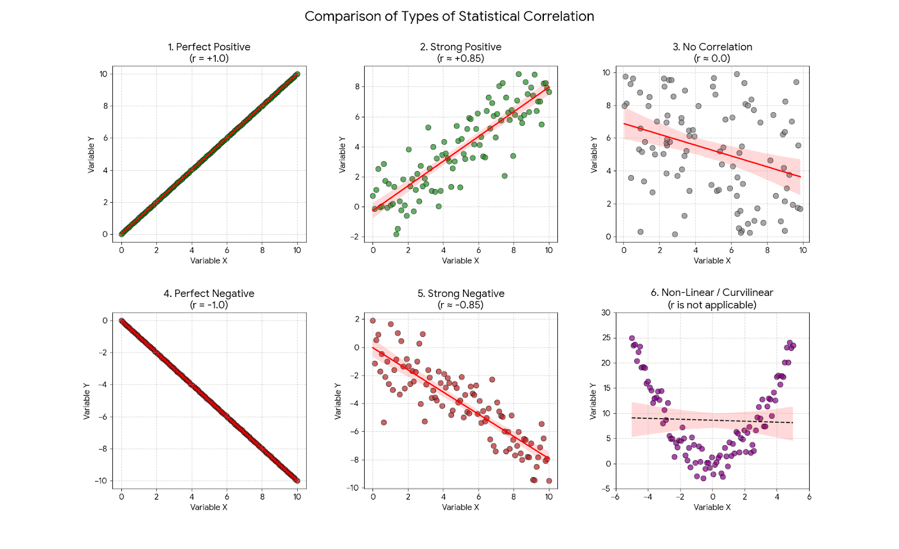


---

## 11. Multivariate Visualization
Techniques for visualizing more than two variables at once.

* **Scatter Plots:** The primary tool for bivariate numerical analysis.
* **Pair Plots:** A grid of scatter plots used to visualize relationships between all pairs of numerical variables in a dataset.
* **Heatmaps:** Often used to visualize a **Correlation Matrix**, showing how all variables in a dataset relate to one another using a color scale.

### 🐍 Python Implementation:
```python
# Calculating Correlation Matrix
correlation_matrix = df.corr()

# Visualizing with a Heatmap
import seaborn as sns
import matplotlib.pyplot as plt

sns.heatmap(correlation_matrix, annot=True, cmap='coolwarm')
plt.show()

# 5-Number Summary
df.describe()
```


---

## 12. Random Variables & Probability Distributions
A **Random Variable** is a numerical description of the outcome of a statistical experiment.

* **Types of Random Variables:**
    * **Discrete:** Takes on a countable number of distinct values (e.g., the outcome of a die roll).
    * **Continuous:** Takes on an infinite number of possible values within a given range (e.g., height, time).
* **Probability Distribution:** A mathematical function that provides the probabilities of occurrence of different possible outcomes for an experiment.

---

## 13. Probability Distribution Functions (PDF vs. PMF)
The way we describe probabilities depends on whether the random variable is discrete or continuous.

* **Probability Mass Function (PMF):** Used for **discrete** random variables. it gives the probability that a discrete random variable is exactly equal to some value.
    * **Example:** $P(X = k)$.
* **Cumulative Distribution Function (CDF) of PMF:** Represents the probability that the variable $X$ will take a value less than or equal to $x$. It is a step function.

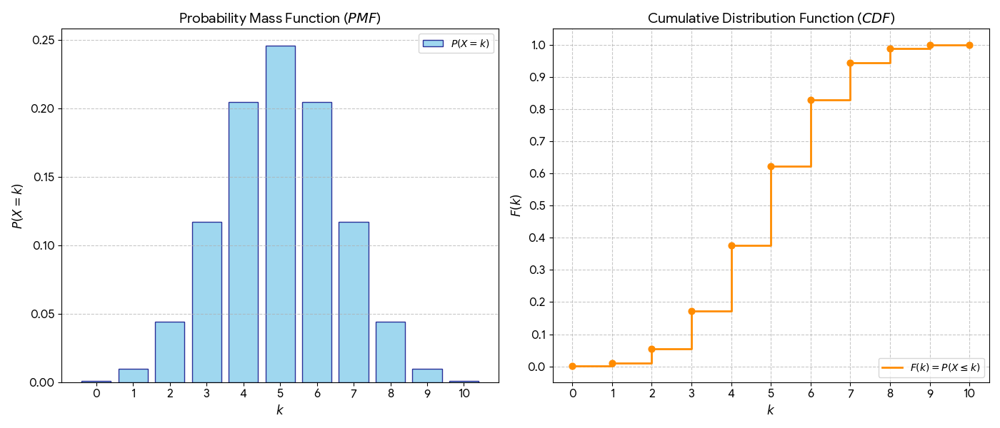


* **Probability Density Function (PDF):** Used for **continuous** random variables. Since the probability of a continuous variable being *exactly* one value is zero, the PDF describes the probability within a particular range (the area under the curve).
* **Cumulative Distribution Function (CDF) of PDF:** The integral of the PDF from $-\infty$ to $x$. It shows the accumulated probability up to a certain point.

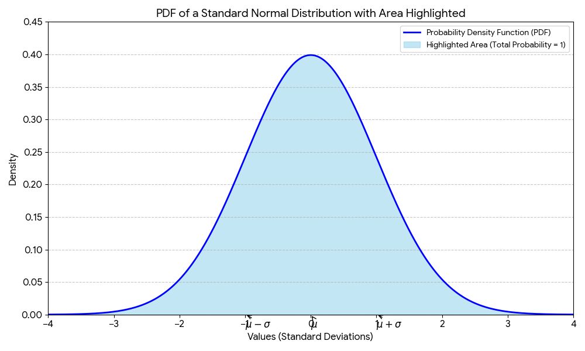


---

## 14. Density Estimation
Density estimation is the construction of an estimate, based on observed data, of an unobservable underlying probability density function.

* **Parametric Density Estimation:** Assumes the data fits a known distribution (like Normal or Poisson) and estimates the parameters (like mean $\mu$ and standard deviation $\sigma$) for that distribution.
* **Non-Parametric Density Estimation:** Does not assume a specific functional form. The most common method is **Kernel Density Estimation (KDE)**.
* **Kernel Density Estimate (KDE):** A way to estimate the PDF of a random variable. It smooths out the observations (the histogram) to create a continuous curve, making it easier to visualize the shape of the data.

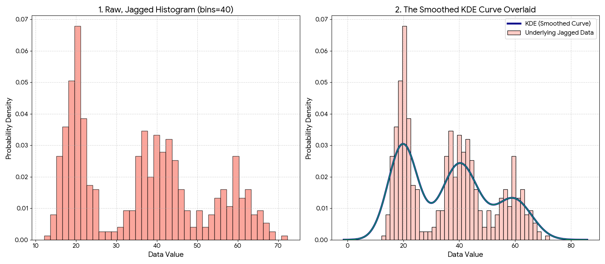


---

### 🐍 Python Implementation:
```python
import seaborn as sns
import matplotlib.pyplot as plt
import numpy as np

# Generate random data
data = np.random.normal(loc=0, scale=1, size=1000)

# Visualizing PDF using KDE
sns.histplot(data, kde=True, stat="density", color="skyblue")
plt.title("Probability Density Function (KDE)")
plt.show()

# Calculating CDF using NumPy
sorted_data = np.sort(data)
y = np.arange(len(sorted_data)) / float(len(sorted_data))
plt.plot(sorted_data, y)
plt.title("Cumulative Distribution Function (CDF)")
plt.show()
```


---

## 15. The Normal Distribution (Gaussian Distribution)
The Normal Distribution is the most important probability distribution in Data Science because many natural phenomena and machine learning residuals follow this "Bell Curve" pattern.

### Why is it important?
* **Central Limit Theorem:** The sums of independent random variables tend toward a normal distribution, even if the original variables themselves are not normally distributed.
* **Model Assumptions:** Many algorithms (like Linear Regression and LDA) assume that the features or errors are normally distributed.

### Equation and Parameters
The shape of the Normal Distribution is determined by two parameters:
1. **Mean ($\mu$):** Determines the center/location of the peak.
2. **Standard Deviation ($\sigma$):** Determines the spread or "fatness" of the curve.

$$f(x) = \frac{1}{\sigma\sqrt{2\pi}} e^{-\frac{1}{2}\left(\frac{x-\mu}{\sigma}\right)^2}$$

---

## 16. Standard Normal Variate ($Z$)
A Standard Normal Distribution is a special case where **$\mu = 0$** and **$\sigma = 1$**.

* **Z-Score Transformation:** We can convert any Normal Distribution to a Standard Normal Distribution using the formula:
  $$Z = \frac{x - \mu}{\sigma}$$
* **Why use Z-Scores?** It allows us to compare data points from different scales and use **Z-Tables** to calculate the probability of a value occurring.

### The Empirical Rule (68-95-99.7 Rule)
In a normal distribution:
* **68%** of data falls within $1\sigma$ of the mean.
* **95%** of data falls within $2\sigma$ of the mean.
* **99.7%** of data falls within $3\sigma$ of the mean.

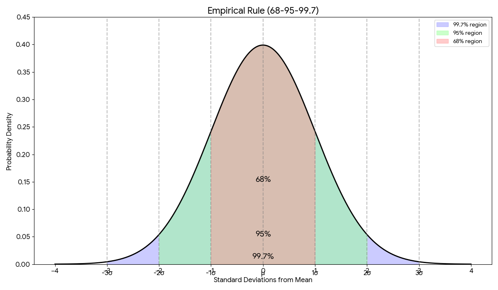


---

## 17. Properties of Normal Distribution
* **Symmetry:** The left half is a mirror image of the right half.
* **Measures of Central Tendency:** The Mean, Median, and Mode are all equal and located at the center.
* **Total Area:** The total area under the curve is always equal to **1** (representing 100% probability).

---

## 18. Skewness
Skewness measures the lack of symmetry in a probability distribution.

* **Positive Skew (Right-Skewed):** The tail on the right side is longer. Mean > Median > Mode.
* **Negative Skew (Left-Skewed):** The tail on the left side is longer. Mean < Median < Mode.
* **Calculation:** Often calculated using the Pearson’s Coefficient of Skewness.

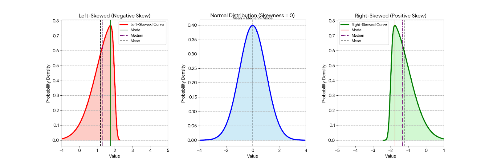
[Image comparing normal distribution with positive and negative skewness]


---

## 19. Using PDF & CDF in Data Science
* **PDF (Probability Density Function):** Used to find the relative likelihood of a continuous random variable falling within a specific range.
* **CDF (Cumulative Distribution Function):** Used to find the probability that a variable is *less than or equal to* a certain value. In ML, this is used for calculating p-values and confidence intervals.
* **2D Density Plots:** Used in Bivariate analysis to see where the highest concentration of data points exists between two variables.

### 🐍 Python Implementation:
```python
import scipy.stats as stats
import matplotlib.pyplot as plt
import numpy as np

# Check for Skewness
data = [1, 2, 2, 3, 3, 3, 10, 15]
print(f"Skewness: {stats.skew(data)}")

# Normal Distribution PDF
x = np.linspace(-4, 4, 100)
plt.plot(x, stats.norm.pdf(x, 0, 1))
plt.title("Standard Normal Distribution")
plt.show()
```
